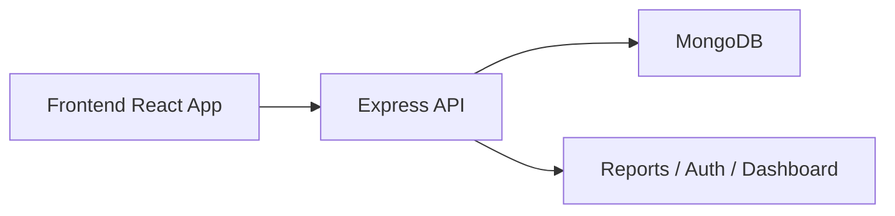

# GymPro

GymPro is a modern gym management admin panel built with React, Vite, Tailwind CSS, Node.js, Express, and MongoDB.

It includes member management, plans, revenue analytics, reports, notifications, dark/light theme support, and a clean responsive dashboard.

## Highlights

- Member CRUD with search, filters, address, branch, and auto-calculated expiry dates
- Plan management with pricing and duration
- Dashboard KPIs and revenue charts
- PDF and Excel report endpoints
- PWA-ready frontend
- Docker Compose support for local full-stack runs

## Stack

- Frontend: React, Vite, Tailwind CSS, Recharts, Axios
- Backend: Node.js, Express, Mongoose, JWT
- Database: MongoDB Atlas or local MongoDB
- Optional: Docker and Docker Compose

The backend seeds demo data on first run and can fall back to a temporary in-memory MongoDB for local development if the configured database is unreachable.

## Project Layout

```text
gym project/
├── backend/        Node.js + Express API
├── frontend/       React + Vite UI
├── docker-compose.yml
└── README.md
```



## Prerequisites

- Node.js 20+
- npm
- MongoDB Atlas account or local MongoDB
- Docker and Docker Compose if you want containerized runs

## Environment Variables

Create a root `.env` file:

```env
MONGODB_URL=mongodb://localhost:27017
DATABASE_NAME=gym_management
JWT_SECRET=change_this_to_a_long_random_secret
JWT_EXPIRY_HOURS=24
MONGODB_SERVER_SELECTION_TIMEOUT_MS=5000
VITE_API_URL=http://localhost:8000/api
```

For MongoDB Atlas, replace `MONGODB_URL` with your Atlas URI.

## Quick Start

Run the backend in one terminal:

```bash
cd backend
npm install
npm run dev
```

Run the frontend in another terminal:

```bash
cd frontend
npm install
npm run dev -- --host
```

Open:

- Frontend: `http://localhost:5173`
- Backend: `http://localhost:8000`
- Health check: `http://localhost:8000/api/health`

Default seeded logins:

```text
Superadmin: superadmin@gym.com / superadmin123
Client admin: admin@am.com / 123
```

## Docker Compose

If Docker is installed:

```bash
docker compose up --build
```

This starts:

- MongoDB on `localhost:27017`
- Backend on `localhost:8000`
- Frontend on `localhost:5173`

Stop it with:

```bash
docker compose down
```

## Useful Commands

```bash
cd backend && npm run dev
cd backend && npm start
cd frontend && npm run dev
cd frontend && npm run build
cd frontend && npm run lint
```

## API Overview

| Method | Endpoint | Purpose |
| --- | --- | --- |
| POST | `/api/auth/login` | Admin login |
| GET | `/api/dashboard/stats` | Dashboard metrics |
| GET/POST | `/api/members` | List or create members |
| GET/PUT/DELETE | `/api/members/{id}` | Member CRUD |
| POST | `/api/members/{id}/renew` | Renew membership |
| GET/POST | `/api/plans` | List or create plans |
| GET/PUT/DELETE | `/api/plans/{id}` | Plan CRUD |
| GET | `/api/revenue/{period}` | Revenue charts |
| GET | `/api/revenue/metrics` | Revenue metrics |
| GET | `/api/reports/{type}/{format}` | PDF / Excel reports |
| GET | `/api/notifications` | Alerts and notifications |

## Troubleshooting

- If login fails, make sure the backend is running and let it finish seeding.
- If the frontend cannot reach the backend, confirm `VITE_API_URL` points to the correct host.
- If MongoDB is unreachable, use Docker Compose or verify the Atlas IP whitelist.
- If a port is busy, stop the old process or change the port before restarting.

## Deployment

The simplest production setup for this repo is:

1. Deploy the backend as a Node.js service.
2. Deploy the frontend as a static site.
3. Point the frontend at the backend with `VITE_API_URL`.
4. Keep MongoDB on Atlas or another managed MongoDB service.

Recommended providers:

- Frontend: Vercel or Netlify
- Backend: Render, Railway, Fly.io, or a VPS with Docker
- Database: MongoDB Atlas

Backend environment variables:

```env
MONGODB_URL=<your-mongodb-connection-string>
DATABASE_NAME=gym_management
JWT_SECRET=<strong-random-secret>
JWT_EXPIRY_HOURS=24
PORT=8000
```

Frontend environment variables:

```env
VITE_API_URL=https://your-backend-domain.com/api
```

Deployment checklist:

- Build the frontend with `npm run build` before publishing.
- Set `VITE_API_URL` to the real backend URL in production.
- Make sure the backend allows requests from your frontend domain via CORS.
- Verify MongoDB Atlas network access allows your backend host.
- Test these URLs after deploy: `/`, `/api/health`, and `/login`.

### Render + Vercel

This is the recommended setup for this project:

- Render hosts the backend API.
- Vercel hosts the frontend React app.
- MongoDB Atlas stores the database.

Backend on Render:

1. Push the repo to GitHub.
2. In Render, create a new Web Service from the `backend` folder.
3. Use these settings:
	- Build command: `npm install`
	- Start command: `npm start`
	- Node version: 20
4. Add environment variables:
	- `MONGODB_URL` = your MongoDB Atlas URI
	- `DATABASE_NAME` = `gym_management`
	- `JWT_SECRET` = a long random secret
	- `JWT_EXPIRY_HOURS` = `24`
	- `PORT` = `8000` if needed by your setup
5. Deploy and copy the public Render URL.

Frontend on Vercel:

1. Create a new Vercel project from the `frontend` folder.
2. Use these settings:
	- Framework preset: Vite
	- Build command: `npm run build`
	- Output directory: `dist`
3. Add environment variables:
	- `VITE_API_URL` = `https://your-render-backend.onrender.com/api`
4. Deploy the site and open the generated Vercel URL.

Final checks:

- Open the frontend URL and log in.
- Confirm `/api/health` works on the backend URL.
- If login fails, confirm `VITE_API_URL` matches the Render backend URL exactly.
- If the backend cannot connect to MongoDB Atlas, check Atlas network access and the connection string.

## GitHub Setup

If you want to publish this repo on GitHub:

```bash
git init
git add .
git commit -m "Initial GymPro project"
git branch -M main
git remote add origin <your-github-repo-url>
git push -u origin main
```
